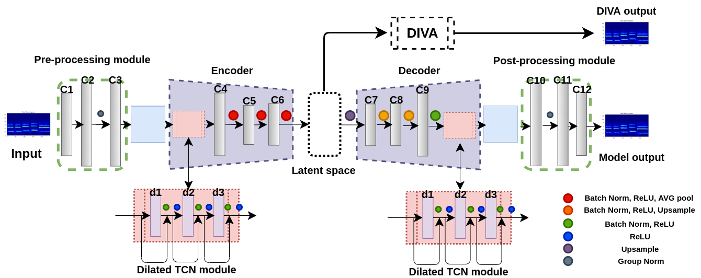
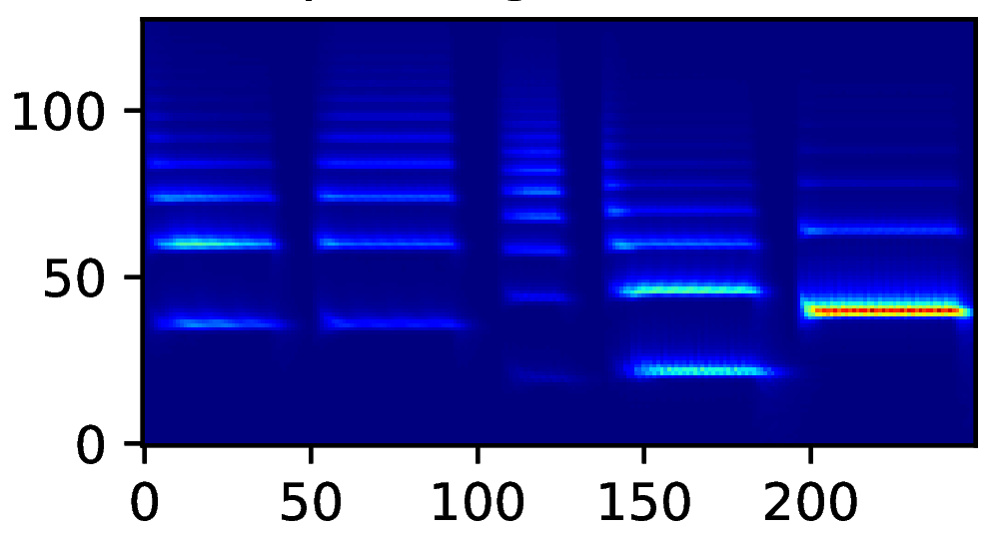
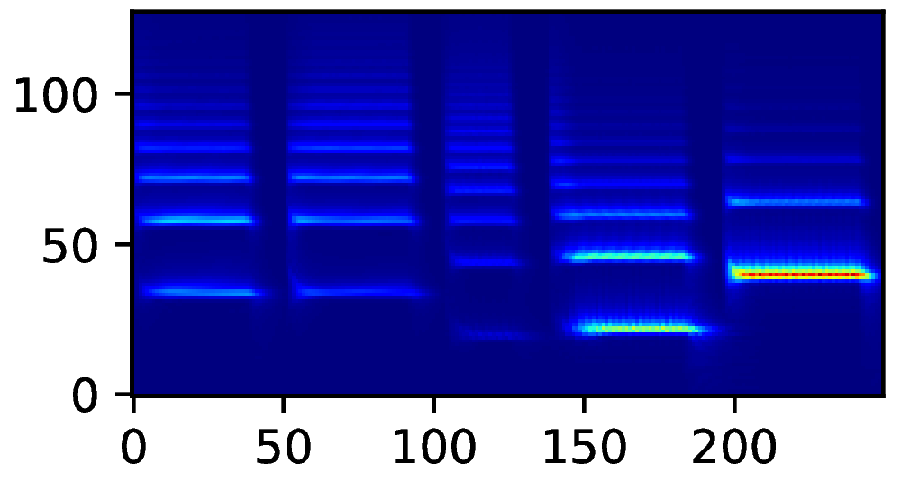

## MirrorNet : Sensorimotor Interaction Inspired Learning for Audio Synthesizer Controls

This website presents audio reconstructions and auditory spectrograms for experiments presented in the paper MirrorNet : Sensorimotor Interaction Inspired Learning for Audio Synthesizer Controls.

### Brief Intro

Experiments to understand the sensorimotor neural interactions in the human cortical speech system support the existence of a bidirectional flow of interactions between the auditory and motor regions. Their key function is to enable the brain to ’learn’ how to control the vocal tract for speech production. This idea is the impetus for the recently proposed ”MirrorNet”, a constrained autoencoder architecture. In this paper, the MirrorNet is applied to learn, in an unsupervised manner, the controls of a specific audio synthesizer (DIVA) to produce melodies only from their auditory spectrograms. The results demonstrate how the MirrorNet discovers the synthesizer parameters to generate the melodies that closely resemble the original and those of unseen melodies, and even determine the best set parameters to approximate renditions of complex piano melodies generated by a different synthesizer. This generalizability of the MirrorNet illustrates its potential to discover from sensory data the controls of arbitrary motor-plants such as autonomous vehicles.

### Audio Reconstructions

## Learning DIVA parameters from melodies synthesized with the same set of parameters (set 1)

    <table class="audioTable">
        <tr>
            <th rowspan="2">Audio</th>
            <th colspan="2">Input Melody</th>
            <th colspan="2">DIVA reconstructed Melody</th>
            <th rowspan="2">Audio</th>
        </tr>
        <tr>
            <th>Parameters</th>
            <th>Spectrogram</th>
            <th>Spectrogram</th>
            <th>Parameters</th>
        </tr>
        <tr>
            <td><audio controls><source src="audio/exp1_real_1.wav"></audio></td>
<!--             <td>PARAMS IMG</td> -->
            <td></td>
            <td></td>
<!--             <td>PARAMS IMG</td> -->
            <td><audio controls><source src="audio/exp1_DIVA_1.wav"></audio></td>
        </tr>
<!--         <tr>
            <td><audio controls><source src="audio/neighborhood/n0/p0_dim_1.mp3"></audio></td>
            <td>PARAMS IMG</td>
            <td></td>
            <td></td>
            <td>PARAMS IMG</td>
            <td><audio controls><source src="audio/neighborhood/n0/p1_dim_1.mp3"></audio></td>
        </tr>
        <tr>
            <td><audio controls><source src="audio/neighborhood/n0/p0_dim_2.mp3"></audio></td>
            <td>PARAMS IMG</td>
            <td></td>
            <td></td>
            <td>PARAMS IMG</td>
            <td><audio controls><source src="audio/neighborhood/n0/p1_dim_2.mp3"></audio></td>
        </tr>
        <tr>
            <td><audio controls><source src="audio/neighborhood/n0/p0_dim_3.mp3"></audio></td>
            <td>PARAMS IMG</td>
            <td></td>
            <td></td>
            <td>PARAMS IMG</td>
            <td><audio controls><source src="audio/neighborhood/n0/p1_dim_3.mp3"></audio></td>
        </tr>
        <tr>
            <td><audio controls><source src="audio/neighborhood/n0/p0_dim_4.mp3"></audio></td>
            <td>PARAMS IMG</td>
            <td></td>
            <td></td>
            <td>PARAMS IMG</td>
            <td><audio controls><source src="audio/neighborhood/n0/p1_dim_4.mp3"></audio></td>
        </tr>
        <tr>
            <td><audio controls><source src="audio/neighborhood/n0/p0_dim_5.mp3"></audio></td>
            <td>PARAMS IMG</td>
            <td></td>
            <td></td>
            <td>PARAMS IMG</td>
            <td><audio controls><source src="audio/neighborhood/n0/p1_dim_5.mp3"></audio></td>
        </tr>
        <tr>
            <td><audio controls><source src="audio/neighborhood/n0/p0_dim_6.mp3"></audio></td>
            <td>PARAMS IMG</td>
            <td></td>
            <td></td>
            <td>PARAMS IMG</td>
            <td><audio controls><source src="audio/neighborhood/n0/p1_dim_6.mp3"></audio></td>
        </tr>
        <tr>
            <td><audio controls><source src="audio/neighborhood/n0/p0_dim_7.mp3"></audio></td>
            <td>PARAMS IMG</td>
            <td></td>
            <td></td>
            <td>PARAMS IMG</td>
            <td><audio controls><source src="audio/neighborhood/n0/p1_dim_7.mp3"></audio></td>
        </tr> -->
    </table>

## Learning DIVA parameters from melodies synthesized with extra unknown DIVA parameters (set 2)

## Learning DIVA parameters to synthesize melodies generated from other synthesizers
